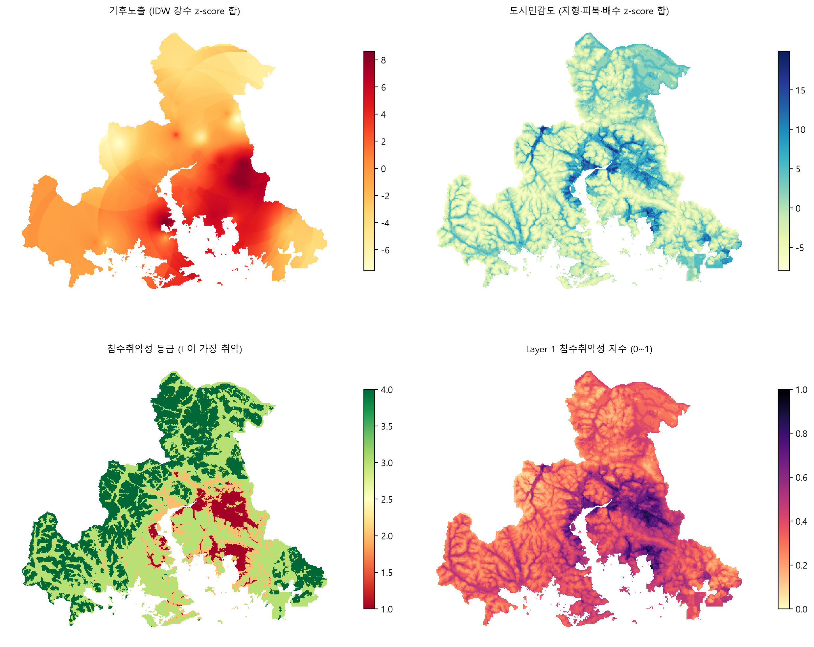
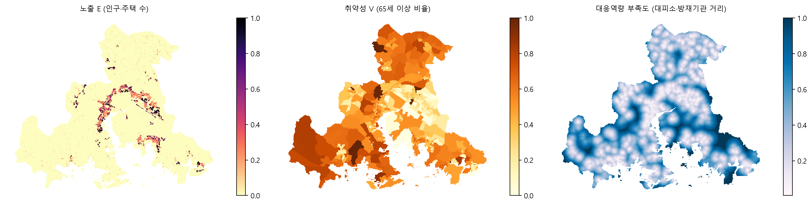
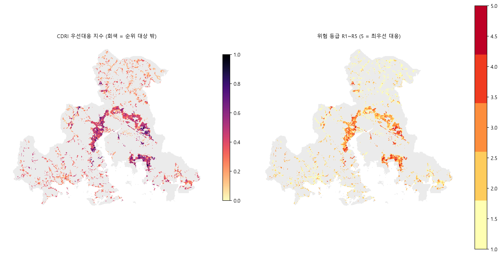

# 분석 방법론 — 무엇을, 왜, 어떻게

> 2026-09-08. 이 문서는 **각 선택의 근거와 수식**을 적는다. 보고서 3장(분석 방법)의 초안이다.
> "무엇이 되어 있나"는 `PROJECT_STATUS.md`, "언제 무엇을"은 `WORK_PLAN_0914.md`.
> 여기 나오는 모든 수식은 `src/` 의 실제 구현과 1:1로 대응한다. 대응 파일을 각 절에 적었다.

> **문서 안내**
> `SCHEDULE.md` 남은 일정·할 일 (앞으로) · `PROJECT_STATUS.md` 지금까지의 경과 ·
> `METHODOLOGY.md` 수식과 근거 · `TEAM_TASKS.md` 팀원 지시서 ·
> `RESEARCH_PLAN.md` 왜 · `ANALYSIS_PLAN.md` 규격 · `RESEARCH_HARNESS.md` 규칙

---

## 0. 먼저 — 예측 모델은 어디 갔나

노트북 `04_modeling.ipynb` 에 `RandomForestClassifier`, `xgboost` import 가 있어서
"예측 모델을 만들기로 한 것 아니냐"는 의문이 생긴다. 이력을 정확히 적는다.

**8월 18일** 초안에서는 통합 위험도를 가중합으로 만들고 ML 을 붙이는 구조를 스케치했다.
그것이 지금 04 노트북에 남아 있는 코드다.

**8월 20일** 하네스를 만들면서 ML 의 위치를 조건부로 확정했다 (`RESEARCH_PLAN.md` §0-5,
`RESEARCH_HARNESS.md` §7).

> 주 분석은 데이터가 부족해도 완성 가능한 동일가중 우선순위지수다.
> 실제 침수·비침수의 위치·날짜가 여러 호우 이벤트에 걸쳐 **충분히 확보된 경우에만**
> 지도학습 모델을 비교한다. 기준모델 로지스틱 회귀, 비교모델 XGBoost + SHAP.

이유는 지도학습의 전제 때문이다. 분류 모델을 학습하려면 각 격자에 정답 $y \in \{0,1\}$
(그 호우 때 잠겼는가)이 있어야 한다. **2026년 9월 7일까지 우리에게는 정답이 한 개도 없었다.**

정답 없이 ML 을 돌리는 방법은 두 가지인데 둘 다 금지했다.

| 편법 | 왜 안 되나 |
|---|---|
| 침수예상도를 정답으로 쓴다 | 예상도는 시가 수리모형으로 만든 **모형 산출물**이다. 모형을 정답으로 학습하면 그 모형을 복제할 뿐이다 |
| 민원 없는 격자를 "비침수"로 둔다 | 민원은 신고 성향에 좌우된다. 사람이 적은 곳은 잠겨도 신고가 없다. 이걸 음성으로 쓰면 인구를 학습하게 된다 |

그래서 하네스는 이렇게 정했다. "양성 라벨만 있을 때 AUC 를 보고하지 않는다.
상위 10/20% 포함률과 무작위 대비 lift 를 쓴다."

**9월 14일에 침수흔적도가 오면 상황이 바뀐다.** 2020~2023년 실제 침수 지구와 날짜가 생기므로
그때 XGBoost 를 학습할 수 있고, 계획대로 해야 한다. §8 에 설계를 적었다.

정리하면, 예측 모델은 **취소된 것이 아니라 라벨을 기다리는 중**이다.
지금 만든 지수는 라벨이 없어도 성립하는 baseline 이고, 9/14 이후 challenger 로 ML 을 붙여
둘을 비교하는 것이 원래 설계다.

---

## 1. 이 분석의 논리 구조

한 문장으로: **예보된 비를 "지역별 영향"과 "행동"으로 번역한다.**

```
기상청 예보 (5km, 이미 잘 맞음)
        │  ← 이 사이가 비어 있다
        ▼
어디가 잠기고 누가 다치는가 (100m)
        ▼
언제 누가 무엇을 하는가
```

기상 예측 자체는 하지 않는다. 2022년 서울 반지하, 2023년 오송 지하차도 모두
강수 예보는 있었다. 문제는 예보가 현장 행동으로 번역되지 않은 것이었다.
이 간극을 다루는 것이 WMO(2015)의 영향기반 예보(impact-based forecasting)이고,
UNDRR 조기경보 4요소 중 "재난위험 지식"과 "행동 가능한 경보"에 해당한다.

따라서 산출물은 **확률 예측이 아니라 우선순위와 행동 계약**이다.

---

## 2. 왜 위험을 네 조각으로 나누는가

### 2.1 근거

IPCC AR5 (2014) SPM Fig. SPM.1 은 기후위험을 세 요소의 상호작용으로 정의한다.

$$\text{Risk} = f(\text{Hazard},\ \text{Exposure},\ \text{Vulnerability})$$

UNDRR 은 여기에 대응역량(Capacity)을 더해 평가한다. 우리는 네 요소를 모두 쓴다.

| 기호 | 요소 | 이 연구에서 묻는 질문 | 우리 변수 |
|---|---|---|---|
| $H$ | Hazard | 실제로 물이 고이는가 | Layer 1 (강수 노출 × 지형·배수) |
| $E$ | Exposure | 문제가 생기면 대상이 얼마나 많은가 | 인구 수, 주택 수 |
| $V$ | Vulnerability | 같은 노출에서 더 크게 다치는가 | 65세 이상 **비율** |
| $D$ | Capacity 부족도 | 얼마나 빨리 대응할 수 있는가 | $1 -$ 대피소·방재기관 접근성 |

**왜 나누는가.** "비가 많이 오는 곳"과 "사람 피해가 클 곳"이 다르기 때문이다.
산속은 $H$ 가 높아도 $E=0$ 이라 우선순위가 아니다. 도심은 $H$ 가 중간이어도
$E$ 와 $V$ 가 높으면 먼저 손봐야 한다. 나누지 않으면 이 구분이 사라진다.

### 2.2 왜 Layer 를 1·2·3 으로 나눴는가

$H$ 안에 물리적으로 **다른 두 메커니즘**이 있다.

| | 내수침수 (Layer 1) | 하수 역류 (Layer 2) |
|---|---|---|
| 현상 | 지표수가 배수되지 못해 고인다 | 관로 용량이 넘쳐 맨홀·배수구로 물이 솟는다 |
| 지배 요인 | 지형(저지대·경사), 불투수면, 하천 수위 | 관로 연장·관경·경과연수, 합류식 여부 |
| 필요 자료 | DEM, 토지피복, 강수 | **관로별 좌표·연도·재질** |

두 현상은 같은 비에도 다른 곳에서 일어난다. 그래서 따로 만들기로 했다.
Layer 3 은 $H$ 가 아니라 사람 쪽($E$, $V$, $D$)을 담는다.

**Layer 2 는 지금 CDRI 에서 빠져 있다.** 관로 자료가 2026-09-01 비공개 통보를 받았기 때문이다
(`docs/decisions/001-layer2-design.md`). 이건 자료 문제이지 설계 문제가 아니다.

### 2.3 왜 곱셈인가

$$\text{CDRI} = \prod_{k \in \{H,E,V,D\}} X_k^{\,w_k}$$

가중합 $\sum_k w_k X_k$ 를 쓰면 한 요소가 0 이어도 다른 요소가 크면 점수가 높아진다.
이것을 보상성(compensability)이라 한다. OECD/JRC(2008) 핸드북 §6 은 **필요조건 관계인 지표들은
기하평균을 써서 비보상적으로 집계하라**고 권고한다.

우리 경우 $E=0$(무인구)인 격자는 아무리 잠겨도 우선대응 대상이 아니다.
기하평균은 $0^{w}=0$ 이므로 이 성질을 자동으로 만족한다.

다만 Moreira et al.(2021)은 기하평균이 값을 체계적으로 과소평가한다고 지적했다.
그래서 가중합도 함께 계산해 두 결과를 비교한다 (§5.4).

---

## 3. Layer 1 — 침수 취약성

구현: `src/data/interpolate.py`, `src/data/layers.py`, `src/stages/h06_layers.py`

### 3.1 왜 "기후노출 × 도시민감도" 인가

국토부 「도시 기후변화 재해취약성분석 지침」(2024.1 개정)이 정한 구조를 그대로 따른다.

$$\text{취약성} = f(\text{기후노출},\ \text{도시민감도})$$

지침이 함께 정한 것들도 그대로 쓴다. **100m 격자**, **z-score 표준화 후 합산**,
**Jenks 자연구분 4등급**, **두 축의 매트릭스**. 이 구조를 따르면 심사에서
"왜 이 방법이냐"는 질문에 국내 공식 지침을 근거로 답할 수 있다.

### 3.2 기후노출 — 지점 통계

관측지점 29곳(2015~2024 관측일 90% 이상)에서 네 변수를 계산한다.
$T$ = 분석기간, $r_t$ = 시각 $t$ 의 시간강수량(mm).

| 변수 | 정의 | 왜 이것인가 |
|---|---|---|
| $x_1$ 연최대 시간강수 | $\dfrac{1}{10}\sum_{y=2015}^{2024}\max_{t \in y} r_t$ | 도시 배수시설은 시간강우 강도로 설계된다 |
| $x_2$ 호우 시간수 | $\dfrac{1}{10}\sum_{y}\left|\{t \in y : r_t \ge 30\}\right|$ | 30mm/h 는 하수관거 설계빈도를 넘는 강도의 관행적 기준 |
| $x_3$ 상위5 3시간 누적 | 겹치지 않는 상위 5개 $\sum_{i=0}^{2} r_{t-i}$ 의 평균 | 내수침수는 단시간 집중호우에 좌우된다 |
| $x_4$ 상위5 24시간 누적 | 겹치지 않는 상위 5개 $\sum_{i=0}^{23} r_{t-i}$ 의 평균 | 선행강수로 토양이 포화된 상태를 반영 |

**"겹치지 않는"이 중요하다.** 그냥 상위 5개를 뽑으면 같은 호우의 연속된 시각이 5번 뽑힌다.
그래서 이미 뽑은 시각과 창 길이(3h·24h) 이내면 건너뛴다.

결측 시간은 **0mm 로 채우지 않는다.** 관측이 없는 것과 비가 안 온 것은 다르다.
누적 계산은 창이 온전히 관측된 구간에서만 한다.

### 3.3 기후노출 — 격자로 옮기기 (IDW)

지점 29곳의 값을 격자 75,400개로 옮겨야 한다. 역거리가중(IDW)을 쓴다.

$$\hat{z}(s_0) = \frac{\displaystyle\sum_{i \in N} d_i^{-p}\, z(s_i)}{\displaystyle\sum_{i \in N} d_i^{-p}},
\qquad N = \{i : d_i \le r,\ i \in \text{최근접 } k\}$$

$k = 12$, $r = 10\text{km}$. **반경 밖에는 외삽하지 않는다.** 반경 안에 지점이 하나도 없으면
최근접 지점 값을 그대로 쓰고 플래그를 세운다(75,400칸 중 514칸).

지수 $p$ 는 정하지 않고 **교차검증으로 고른다.** 지점을 하나씩 빼고 나머지로 그 지점을
예측해 오차를 잰다(leave-one-out).

$$\text{RMSE}(p) = \sqrt{\frac{1}{n}\sum_{j=1}^{n}\bigl(\hat{z}_{-j}(s_j) - z(s_j)\bigr)^2},
\qquad p^\star = \arg\min_{p \in \{1,2,3\}} \text{RMSE}(p)$$

실제 결과:

| 변수 | $p=1$ | $p=2$ | $p=3$ | 선택 |
|---|---:|---:|---:|:--:|
| 연최대 시간강수 | **4.03** | 4.07 | 4.21 | 1 |
| 호우 시간수 | **0.47** | 0.48 | 0.50 | 1 |
| 상위5 3시간 | 10.43 | 9.42 | **9.15** | 3 |
| 상위5 24시간 | 17.23 | **16.73** | 17.18 | 2 |

변수마다 다른 $p$ 가 뽑혔다. 짧은 시간 강수일수록 공간 변동이 커서 $p$ 가 크다.

### 3.4 도시민감도 — 변수와 부호

부호 $s_k$ 는 계산 **전에** 물리적 근거로 고정한다. 결과를 보고 바꾸지 않는다.

| 변수 | $s_k$ | 수식 / 산출 | 물리적 근거 |
|---|:--:|---|---|
| 상대고도 $R$ | $-1$ | $R(c) = z(c) - \overline{z}_{W_{500}(c)}$ | 주변보다 낮으면 물이 모인다 |
| 경사 $S$ | $-1$ | $S = \arctan\sqrt{(\partial_x z)^2 + (\partial_y z)^2}$ | 평평하면 배수가 느리다 |
| TWI | $+1$ | $\ln\dfrac{a}{\tan\beta}$ | 지형상 물이 모이는 정도 |
| 불투수면 비율 | $+1$ | 셀 안 시가화·건조지역 면적비 | 침투가 막혀 유출이 빠르다 |
| 하천 근접도 | $+1$ | $\max\bigl(0,\ 1 - d_{\text{하천}}/300\bigr)$ | 하천 수위 상승 시 배수구 역류 |
| 복개천 근접도 | $+1$ | $\max\bigl(0,\ 1 - d_{\text{복개}}/300\bigr)$ | 복개 구간은 통수능이 제한돼 월류하기 쉽다 |
| 예상 침수심 | $+1$ | 창원시 침수예상도 L210(내수, 100년) 면적가중 평균 | 시가 수리모형으로 계산한 값 |
| 펌프장 서비스권 | $+1$ | 반경 1km 이내 = 1 | 펌프장이 있다 = 자연배수가 안 되는 지역이라는 행정적 인정 |

변수 선정 근거는 최유라·한우석(2024)이 창원 피해 가중요인으로 지목한
**저지대·복개천·하천변·불투수면·지하차도**다. 이 중 복개천과 하천선은 2026-09-08 에
OpenStreetMap 하천망(창원 728개, 총연장 501km, 복개 191개)을 확보하면서 비로소 변수가 되었다.
그 전에는 토지피복 '내륙수'(폭이 있는 수역만 잡힌다)로 대체하고 있었다.

**TWI 의 정의를 풀면 이렇다.**

$$\text{TWI} = \ln\frac{a}{\tan\beta}, \qquad a = A_{\text{up}} \cdot \Delta, \qquad \tan\beta = \max\bigl(|\nabla z|,\ 0.001\bigr)$$

$A_{\text{up}}$ 은 그 칸으로 흘러드는 상류 칸 수, $\Delta = 100\text{m}$ 는 칸 크기,
$\beta$ 는 국지 경사다. 분자가 크고(물이 많이 모이고) 분모가 작으면(평평하면) TWI 가 커진다.
$\tan\beta$ 에 하한 0.001 을 둔 이유는 완전히 평평한 칸에서 0 으로 나누는 것을 막기 위해서다.

$A_{\text{up}}$ 을 구하려면 먼저 DEM 의 움푹 팬 곳(sink)을 메워야 한다. 안 그러면 물이
거기 갇혀 하류로 흐르지 않는다. Barnes et al.(2014)의 priority-flood 를 구현했다.

### 3.5 표준화와 합산

변수마다 단위가 다르므로(m, 도, 비율, mm) 그대로 더할 수 없다. 두 단계를 거친다.

**① 윈저라이즈** — 상하위 1%를 잘라낸다. 이상치 하나가 z-score 전체를 눌러버리는 것을 막는다.

$$\tilde{x}_i = \min\bigl(\max(x_i,\ Q_{0.01}),\ Q_{0.99}\bigr)$$

**② z-score 표준화 후 부호 정렬 합산**

$$Z_{\text{노출}} = \sum_{k=1}^{4} s_k \cdot \frac{\tilde{x}_k - \mu_k}{\sigma_k}, \qquad
Z_{\text{민감도}} = \sum_{k=1}^{7} s_k \cdot \frac{\tilde{x}_k - \mu_k}{\sigma_k}$$

가중치는 **동일가중**이다. 가중치를 바꾸는 것은 H07 민감도 분석의 일이고,
여기서 임의로 정하면 근거 없는 자유도가 생긴다.

$$L_1 = \text{minmax}\bigl(Z_{\text{노출}} + Z_{\text{민감도}}\bigr) \in [0, 1]$$

### 3.6 Jenks 자연구분이란 무엇인가

지침이 요구하는 4등급을 만들 때 균등 구간이나 분위수를 쓰지 않고 Jenks 를 쓴다.

**정의.** 값 $x_1 \le \dots \le x_n$ 을 $k$ 개 급간으로 나눌 때,
**급간 내부 편차제곱합을 최소로 만드는** 경계를 찾는다.

$$\min_{b_1 < \cdots < b_{k-1}} \; \sum_{j=1}^{k} \sum_{x_i \in C_j} \bigl(x_i - \bar{x}_{C_j}\bigr)^2$$

**왜 이것인가.** 값이 자연스럽게 뭉쳐 있는 곳에서 자르므로, 비슷한 값이 다른 등급으로
갈라지는 일이 적다. 분위수는 등급마다 개수를 똑같이 맞추느라 뭉친 값을 억지로 자른다.

**구현 검증.** 외부 패키지(jenkspy, mapclassify) 없이 직접 구현했으므로,
14개짜리 작은 표본에서 **모든 분할을 완전탐색한 최적값과 대조**했다. 8회 모두 소수점 6자리까지
일치했다 (`tests/test_layers.py::JenksTest::test_matches_brute_force_on_small_samples`).

### 3.7 취약성 매트릭스

노출 등급 $g_E$ 와 민감도 등급 $g_S$ (각 1~4, 4가 높음)를 합쳐 취약성 I~IV 를 준다.

$$g_E + g_S \;\longmapsto\;
\begin{cases}
\text{I (가장 취약)} & 7,\ 8\\
\text{II} & 6\\
\text{III} & 4,\ 5\\
\text{IV} & 2,\ 3
\end{cases}$$

**두 축이 모두 높아야 I 이 된다.** 비만 많이 오고 지형이 안전하면(또는 반대면) I 이 아니다.

결과: I 4,752칸 / II 7,942 / III 36,355 / IV 26,351.



---

## 4. Layer 3 — 노출·취약성·대응역량

구현: `src/data/sgis.py`, `src/data/shelters.py`, `src/stages/h06_layers.py`

### 4.1 왜 노출은 "수", 취약성은 "비율" 인가

이중계산을 막기 위해서다. 고령 인구를 $E$ 에도 넣고 $V$ 에도 넣으면 같은 사람을 두 번 센다.

$$E = \text{minmax}\bigl(z(\text{인구 수}) + z(\text{주택 수})\bigr), \qquad
V = \text{minmax}\bigl(z(\text{65세 이상 비율})\bigr)$$

$E$ 는 "몇 명이 영향받나", $V$ 는 "그중 더 취약한 사람의 밀도가 얼마나 되나"를 답한다.

### 4.2 연령 코드북을 "항등식으로 확인했다"는 것의 의미

SGIS 집계구 통계에는 `in_age_001` ~ `in_age_081` 이라는 코드만 있고 **설명 문서가 없다.**
어느 코드가 65세 이상인지 모르면 고령 비율을 만들 수 없다.
하네스는 이 상황을 예상하고 "연령 코드북 확정 전 65세 이상 파생 금지"라고 못박아 두었다.

**가설.** 5세 계급 21개(0\~4, 5\~9, …, 100+)가 전체·남자·여자 세 블록으로 반복된다.
즉 `in_age_001` = 0\~4세, `in_age_014` = 65\~69세.

**검증 방법.** 통계청은 같은 자료에 **노령화지수** `to_in_004` 를 함께 공표한다. 그 정의는

$$\text{노령화지수} = \frac{P_{65+}}{P_{0\text{-}14}} \times 100$$

가설이 맞다면, 우리가 코드로 계산한 값과 공표값이 같아야 한다. 이 **같아야 하는 관계**가 항등식이다.

$$\underbrace{\frac{\sum_{j=14}^{21}\texttt{in\_age}_j}{\sum_{j=1}^{3}\texttt{in\_age}_j}\times 100}_{\text{우리 계산}}
\;\stackrel{?}{=}\;
\underbrace{\texttt{to\_in\_004}}_{\text{통계청 공표}}$$

**결과.** 집계구 1,985개에서 비교했다.

| 가설 | 65세 이상 시작 코드 | 공표값과의 상관 | 중앙 절대오차 |
|---|---|---:|---:|
| **채택** | `in_age_014` (65세~) | **0.963** | **7.7** |
| 기각 | `in_age_013` (60세~) | 0.955 | 100.0 |
| 기각 | `in_age_015` (70세~) | 0.957 | 80.0 |

**"한 칸 당긴 대안이 오차 10배"란 이 표를 말한다.** 코드를 하나 앞뒤로 옮기면
중앙 절대오차가 7.7 에서 80~100 으로 뛴다. 즉 `in_age_014` 만이 공표값과 맞는다.

오차가 0 이 아닌 이유는 SGIS 가 **5명 미만 칸을 마스킹**하기 때문이다.
그래서 비율의 분모도 총인구가 아니라 **연령 계급의 합**을 쓴다. 총인구를 분모로 쓰면
마스킹된 인원만큼 비율이 체계적으로 낮아진다.

**검산.** 이렇게 구한 창원시 65세 이상 비율은 18.4%, 격자에 옮긴 뒤 인구가중 평균은 19.2% 다.
창원시 공표 고령화율(약 18%)과 맞는다.

### 4.3 집계구를 격자로 옮길 때의 한계

연령은 100m 격자가 아니라 **집계구**(평균 500명 단위) 로만 발행된다.
격자 중심점이 속한 집계구의 **비율**을 그대로 준다. 인구 수를 면적 비례로 쪼개지 않는 이유는
비율이 그 지역의 성질이지 면적의 성질이 아니기 때문이다.

한계는 명확하다. 집계구 하나가 최대 106개 격자에 같은 값을 준다.
집계구 안에서의 변화는 보이지 않는다. Layer 3 지도에 패치가 보이는 것이 그 때문이다.

### 4.4 대응역량

$$C = 1 - \frac{1}{2}\left(\frac{\min(d_{\text{대피소}}, 2000)}{2000} + \frac{\min(d_{\text{방재기관}}, 2000)}{2000}\right), \qquad D = 1 - C$$

$C$ 는 높을수록 좋고, 우선순위에는 **부족도** $D$ 를 쓴다. 2km 상한을 둔 이유는
그보다 멀면 도보 대피가 어렵다는 점에서 차이가 의미를 잃기 때문이다.

**펌프장은 여기 넣지 않았다.** 이미 Layer 1 의 배수조건 변수로 썼기 때문이다.
같은 변수를 두 곳에 넣으면 가중치가 두 배가 된다 (하네스 §7 이중투입 금지).



---

## 5. CDRI 통합

구현: `src/data/layers.py`, `src/stages/h07_cdri.py`

### 5.1 왜 $[0.05,\ 1]$ 로 다시 맞추나

기하평균에는 치명적 성질이 있다. **한 요소가 정확히 0 이면 전체가 0 이다.**

$$X_H^{0.25} \cdot X_E^{0.25} \cdot X_V^{0.25} \cdot 0^{0.25} = 0$$

minmax 정규화를 하면 각 요소의 최솟값이 정확히 0 이 된다. 그러면 어느 한 요소에서
꼴찌인 격자는 나머지가 아무리 높아도 CDRI 가 0 이 되어 순위 정보가 통째로 사라진다.

그래서 하한을 0 이 아니라 0.05 로 둔다.

$$X' = 0.05 + 0.95 \cdot \frac{X - \min X}{\max X - \min X} \in [0.05,\ 1]$$

**"0 이면 0"의 의도는 유지하면서**(0.05 는 여전히 매우 작아 강하게 끌어내린다)
정보 소실만 막는 장치다. ANALYSIS_PLAN §5 가 지정한 값이다.

### 5.2 집계 수식

$$\boxed{\;\text{CDRI}_i = \prod_{k \in \{H,E,V,D\}} \left(X'_{ik}\right)^{w_k}
= \exp\left(\sum_k w_k \ln X'_{ik}\right)\;}$$

기본 가중치는 $w_k = 1/4$ 다. 비교용으로 가중합도 계산한다.

$$\text{CDRI}^{\text{add}}_i = \sum_k w_k X'_{ik}$$

여기서 $X'_H = L_1$(Layer 1), $X'_E$, $X'_V$, $X'_D$ 는 Layer 3 산출물이다.
**순위 대상 격자 10,202개 안에서만 재척도한다.** 무인구 격자를 포함해 정규화하면
분포가 왜곡된다.

### 5.3 엔트로피 가중치란

동일가중 말고 데이터가 정하는 가중치도 비교한다. 정보 엔트로피가 작은(= 격자 간
변별력이 큰) 지표에 큰 가중치를 준다.

$$p_{ik} = \frac{X'_{ik}}{\sum_{i} X'_{ik}}, \qquad
e_k = -\frac{1}{\ln n}\sum_{i} p_{ik}\ln p_{ik}, \qquad
w_k = \frac{1 - e_k}{\sum_j (1 - e_j)}$$

**실제 결과가 중요하다.** 엔트로피 가중치는 $w = (0.082,\ 0.641,\ 0.125,\ 0.152)$ 로
**$E$(인구)에 64%를 몰아줬다.** 인구 분포의 왜도가 매우 크기 때문이다(대부분 0 근처, 일부만 큼).
이건 이론 틀(네 요소가 모두 필요조건)과 어긋나므로 기본 산식으로 쓰지 않고, **민감도 비교용**으로만 쓴다.

### 5.4 민감도 설계 — 그리고 그 결과가 이 연구의 핵심 발견

산식을 네 가지로 바꿔 순위가 얼마나 흔들리는지 본다.

| 변형 | 기준과의 Spearman $\rho$ | 상위 20 중 겹침 |
|---|---:|---:|
| 곱셈 · 동일가중 (**기준**) | 1.000 | 20 |
| 가법 · 동일가중 | 0.885 | 9 |
| 곱셈 · 엔트로피 | 0.850 | 10 |
| 가법 · 엔트로피 | 0.927 | 9 |

**해석.** 전체 순위 경향은 잘 유지된다($\rho \ge 0.85$). 그런데 **최상위 20곳은 절반만 겹친다.**
상위권은 값 차이가 미세해서 산식을 조금만 바꿔도 순서가 뒤집히기 때문이다.

하네스 H07 은 이 경우를 미리 정해 두었다.

> 중위 $\rho \ge 0.8$, TOP20 중첩 $\ge 70\%$. 미달이면 **정밀 순위 대신 위험군(tier) 모드로 보고.
> 재튜닝 루프 금지.**

중위 $\rho = 0.885$ 는 통과했지만 중첩 9/20 은 미달이다. 그래서 **기준을 낮추지 않고**
산출물의 성격을 바꿨다. 정밀 순위를 주장하지 않고 두 가지로 보고한다.

1. **강건 공통집합** — 네 변형 **모두**의 상위 20에 드는 격자 8곳
2. **위험군** — 나머지는 순위 없이 Balica 5등급으로

이것은 실패가 아니라 결과다. "20곳을 정확히 줄 세웠다"는 주장보다 방어하기 쉽다.

### 5.5 그 밖의 민감도

| 점검 | 방법 | 결과 |
|---|---|---|
| 해상도(MAUP) | 500m 블록으로 재집계, 평균 vs 최대 | $\rho = 0.883$ |
| 등급화 방식 | Balica 5등급 vs Jenks 5등급, Cohen $\kappa$ | $\kappa = 0.236$ |

$$\kappa = \frac{p_o - p_e}{1 - p_e}$$

$\kappa = 0.236$ 은 낮다. **등급 경계를 어떻게 정하냐에 따라 등급이 크게 바뀐다**는 뜻이고,
Moreira et al.(2021)이 "복합지수에서 등급화가 가장 민감한 단계"라고 한 것과 일치한다.
그래서 두 방식을 모두 표에 싣는다.

### 5.6 주 원인을 어떻게 정하나 — 왜 백분위인가

각 격자에 "왜 여기가 위험한가"를 하나 붙여야 조치가 정해진다. 두 가지 후보가 있다.

**후보 A: 가법형 구성비의 최댓값**

$$C_k(i) = \frac{w_k X'_{ik}}{\sum_j w_j X'_{ij}}, \qquad \text{주원인} = \arg\max_k C_k(i)$$

**후보 B: 구성요소 백분위의 최댓값**

$$\text{주원인} = \arg\max_k \; \text{rank}_{\text{pct}}\bigl(X'_{\cdot k}\bigr)_i$$

**처음에 A 를 썼더니 상위 20곳 중 19곳이 $E$(인구)로 나왔다.** 이유는 분명하다.
$E$ 의 분포가 가장 치우쳐 있어서 상위 격자의 $E$ 값이 절대적으로 크고, 구성비 경쟁에서 항상 이긴다.
그러면 조치가 전부 "도로 통제" 하나로 쏠려 쓸모가 없어진다.

ANALYSIS_PLAN §5 는 원래 **"최대 백분위 요소 = 주 원인"** 이라고 적혀 있었고, 내가 잘못 구현한 것이었다.
B 로 고치자 결과가 이렇게 바뀌었다.

| | H 침수 | E 노출 | V 취약 | D 역량부족 |
|---|---:|---:|---:|---:|
| 후보 A (구성비) | 1 | **19** | 0 | 0 |
| **후보 B (백분위, 채택)** | 4 | 12 | 2 | 2 |
| 전체 10,202칸 (B) | 2,342 | 2,729 | 2,966 | 2,165 |

백분위는 "이 격자가 **다른 격자와 비교해** 어느 요소에서 가장 두드러지는가"를 묻는다.
절대값 비교가 아니라 상대적 위치 비교라 분포 왜도의 영향을 받지 않는다.



---

## 6. 우선대응 지역 선정

구현: `src/stages/h08_policy.py`

### 6.1 300m 억제(NMS)

CDRI 상위 20칸을 그냥 뽑으면 같은 침수 구역의 인접 격자가 여러 번 뽑힌다.
가장 높은 칸을 고르고 반경 300m 안의 나머지를 지우는 것을 반복한다.

$$\text{선정} \leftarrow \arg\max_i \text{CDRI}_i, \qquad
\text{후보} \leftarrow \text{후보} \setminus \{j : \|s_j - s_{\text{선정}}\| < 300\text{m}\}$$

### 6.2 트리거를 시간이 아니라 특보로 바꾼 이유

초기 계획은 "24시간 전 점검, 6시간 전 배치"였다. 그런데 **그 시간 기준의 근거가 없다.**
창원시 SOP 를 확인하지 못했고, 확인 전에는 하네스가 "공모전 시범 시나리오"로만 표기하라고 정했다.

그래서 **기상청 호우특보 공식 기준**으로 바꿨다.

| 단계 | 기준 | 조치 |
|---|---|---|
| 호우주의보 | 3시간 60mm 또는 12시간 110mm | 사전 점검·연락·장비 배치 |
| 호우경보 | 3시간 90mm 또는 12시간 180mm | 통제·대피 지원 |

이건 법령상 공표 기준이므로 근거가 확실하고, 담당자가 실제로 쓰는 신호와 일치한다.

### 6.3 주 원인 → 행동 계약

| 주 원인 | 조치 | 담당 | 성과지표 |
|---|---|---|---|
| $H$ | 우기 전 준설, 이동식 펌프 배치 지점 지정 | 하수도사업소 | 준설 완료율, 침수신고 건수 |
| $E$ | 호우경보 시 지하공간·도로 통제 우선 구간 | 재난안전대책본부 | 통제 선행시간 |
| $V$ | 고령가구 사전 연락 명단 갱신 | 행정복지센터 | 연락 완료율 |
| $D$ | 임시 대피장소 추가 지정 | 재난안전대책본부 | 신규 지정 수, 거리 단축량 |

선정 20곳: 인구 8,714명, 65세 이상 3,234명, 강건 공통집합 7곳 포함.

---

## 7. 검증 — 한 것과 못 한 것

### 7.1 지금 한 것은 "내적 일관성" 점검이지 성능 검증이 아니다

**먼저 앞선 문서의 표현을 정정한다.** "지형 변수와 침수예상 침수심의 상관이 0.42 였다"를
검증처럼 썼는데, 그건 **검증이 아니다.** 침수예상도는 Layer 1 의 **입력이기도** 하므로
자기 입력과의 상관을 성능 근거로 쓰면 순환 논증이다.

그 상관이 실제로 말해 주는 것은 이것뿐이다.

> 우리가 DEM·토지피복에서 독립적으로 계산한 지형 변수가, 창원시가 수리모형으로 만든
> 침수예상도와 **같은 방향으로 움직인다.** 즉 좌표계 오류나 부호 반전 같은
> **계산 실수가 없다.**

이건 sanity check 이지 성능이 아니다. 그렇게만 쓴다.

| 점검 | 방법 | 결과 | 성격 |
|---|---|---|---|
| 연령 코드북 | 노령화지수 항등식 대조 | 상관 0.963, 대안 오차 10배 | **확인** |
| Jenks 구현 | 완전탐색 최적해와 대조 | 8회 일치 | **확인** |
| 근사 좌표 2곳 | 비 온 날 882일 일강수 상관 | 이웃 지점 0.97 | **확인** |
| 격자 인구 | 주민등록 인구와 대조 | 100.6% | **확인** |
| 부호·좌표계 오류 | 침수예상도와의 상관 부호 | 전부 예상대로 | sanity check |
| 사례지 face-validity | 선행연구 현장조사 4개 동의 I·II등급 비율 | lift 1.63 (기준 1.5) | 외부 참조 |
| 변수 과의존 | 하천·복개·예상도 제외 후 재계산 | $\rho = 0.904$ | 강건성 |
| 산식 선택 | 4개 변형 비교 | 중첩 9/20 | 강건성 (미달) |
| 코드 | 단위 테스트 78건 | 통과 | **확인** |

### 7.2 사례지 face-validity — 통과 (2026-09-08)

최유라·한우석(2024)이 **현장조사로** 지목한 창원 침수 취약 사례지가 우리 지도에서도
높은 등급으로 나오는지 본다. 논문은 법정동 이름을 쓰고 우리 경계는 행정동이라
대응이 확인된 것만 넣었다 (양덕동 → 양덕1·2동, 봉암동, 팔용동 → 팔룡동).
명서동·사화동은 관할 행정동을 확인하지 못해 제외했다.

$$\text{lift} = \frac{P(\text{I·II등급} \mid \text{사례지})}{P(\text{I·II등급} \mid \text{전체})}
= \frac{0.610}{0.375} = 1.63 \;\ge\; 1.5 \;\checkmark$$

사례지 428격자에서 I·II등급 비율이 61.0%로, 순위대상 전체 37.5%의 **1.63배**다.

**이것도 성능 검증은 아니다.** 하네스 §7 이 정한 대로 face-validity 점검으로만 보고한다.
사례지가 4개 행정동뿐이고, 논문이 그곳을 고른 기준이 우리 변수와 겹칠 수 있기 때문이다.

### 7.3 못 한 것 — 이것이 가장 큰 공백

**실제로 잠겼던 곳과 대조한 적이 한 번도 없다.** 그래서 지금은

- ROC-AUC 를 보고할 수 없다
- "우리 상위 20%가 실제 침수의 몇 %를 잡았다"를 말할 수 없다
- 예측 모델을 학습할 수 없다

하네스가 이 상태를 코드에 강제해 두었다. Layer 1 산출물에 `label_available = false` 가
기록되고, 이 값이 false 인 한 **예측 성능을 주장하는 문장을 보고서에 쓰지 않는다.**

---

## 8. 9월 14일 이후 — 여기서 예측 모델이 들어온다

침수흔적도(2020~2023 실제 침수 지구·날짜)가 오면 세 가지가 한꺼번에 가능해진다.

### 8.1 Layer 1 외적 검증

$$\text{AUC} = P\bigl(L_1(\text{침수 격자}) > L_1(\text{비침수 격자})\bigr)$$

기준은 $\text{AUC} \ge 0.70$, 상위 20% 격자의 흔적 포착률 $\ge 50\%$ 다.
참고값으로 Bersabe & Jun(2025)의 서울 랜덤포레스트 AUC 0.902 가 있다.

### 8.2 사후검증 (hindcast) — 보고서의 첫 숫자가 될 것

2019년까지의 자료만으로 지수를 만들고, 2020~2023년 실제 침수를 얼마나 지목했는지 본다.

> "2020~2023년 실제 침수 N건 중 M건이 우리 상위 20% 격자 안에 있었다"

이 한 문장이 "지도를 만들었다"를 "실제로 맞췄다"로 바꾼다.

### 8.3 예측 모델 (계획대로의 challenger)

$$y_i = \mathbb{1}[\text{격자 } i \text{ 가 해당 호우에 침수}], \qquad
\hat{y} = f(\text{강수},\ \text{지형},\ \text{피복},\ \text{하천},\ \text{배수조건})$$

- **기준모델**: 로지스틱 회귀
- **비교모델**: XGBoost + SHAP (어느 변수가 얼마나 기여했는지 설명)
- **평가**: 행정동 GroupKFold 공간 교차검증. 무작위 CV 는 공간 자기상관 때문에 금지
- **불균형**: `scale_pos_weight` $= N_{\text{음성}}/N_{\text{양성}}$
- **주지표**: PR-AUC (양성이 희소하므로 ROC-AUC 보다 적절)

**주의할 점.** 침수흔적 69건은 격자 수천 개에 걸치더라도 **사건 수가 4년 69건**이라
과적합 위험이 크다. 그래서 ML 은 지수를 대체하지 않고 **비교모델**로만 쓰고,
채택 기준은 baseline 대비 지표 개선 + 구별 편향 + 순위 안정성이다.

### 8.4 강우 임계치 — 실무에 가장 쓸모 있는 산출

침수흔적 날짜와 시간별 강수를 맞추면 지구별로 이렇게 말할 수 있다.

> "이 지구는 시간당 N mm 를 넘겼을 때 잠겼다"

시나리오 3단계(50·100·200년 빈도)뿐인 침수예상도보다 담당자가 바로 쓸 수 있는 형태다.

---

## 9. 한계 (보고서에 그대로 쓸 것)

| # | 한계 | 영향 | 완화 |
|---|---|---|---|
| 1 | 외적 검증 없음 | 성능 주장 불가 | 9/14 침수흔적도 |
| 2 | 정밀 순위 비강건 (중첩 9/20) | 순위 주장 불가 | 위험군 + 강건 공통집합으로 보고 |
| 3 | Layer 2 부재 (관로 비공개) | 주제의 "하수 역류" 축이 빔 | 결정 001, 보고서에 근거조항까지 명시 |
| 4 | $V$ 변수 1개(고령비율)뿐 | 취약성 축이 얇다 | 1인가구 미보유, 건물 자료 미신청 |
| 5 | 해상도 혼재 | "100m 분석" 표현이 과장될 수 있음 | 아래 표를 보고서에 그대로 게재 |
| 6 | IDW 동심원 무늬 | 관측지점 주변 과대평가 | 기상청 AWS 추가 시 완화 |
| 7 | 집계구→격자 배분 | 집계구 하나가 최대 106칸에 같은 값 | 한계 명시, 500m MAUP 병기 |
| 8 | 등급화 민감 ($\kappa=0.236$) | 등급 경계가 결과를 바꿈 | 두 방식 병기 |
| 9 | 민원 자료 부재 | 연구 질문 1번 답 못 함 | 이의신청, 시민의소리 대체 |

**해상도 실태 (한계 5)**

| 입력 | 실제 해상도 |
|---|---|
| 인구·주택, 토지피복, 침수예상도 | 100m (진짜) |
| DEM | 90m → 100m 재표집. 경사·TWI 가 평활화 |
| 65세 이상 비율 | 집계구 (수백 m ~ km) |
| 강수 관측지점 | 일부는 행정복지센터 대표점 |
| 하천·복개천 거리 | OSM 하천 중심선 (2026-09-08 확보). 지역별 매핑 밀도 차이는 한계 |

---

## 부록 A. 수식과 코드 대응표

| 수식 | 구현 |
|---|---|
| IDW, LOOCV | `src/data/interpolate.py: idw, loocv_rmse, choose_power` |
| 노출 변수 4개 | `src/data/interpolate.py: station_exposure` |
| 경사·상대고도·TWI·싱크채움 | `src/data/features.py: slope_deg, relative_elevation, twi, fill_sinks` |
| 윈저라이즈·z-score·합산 | `src/data/layers.py: winsorize, zscore, composite` |
| Jenks | `src/data/layers.py: jenks_breaks, classify` |
| 취약성 매트릭스 | `src/data/layers.py: VULNERABILITY_MATRIX, vulnerability_class` |
| 재척도·기하평균·가중합·엔트로피 | `src/data/layers.py: rescale_positive, geometric_aggregate, additive_aggregate, entropy_weights` |
| Balica 등급·Cohen $\kappa$·기여도 | `src/data/layers.py: balica_tier, cohen_kappa, contribution_share` |
| 연령 코드북 | `src/data/sgis.py: age_columns, elderly_ratio` |
| 300m NMS | `src/stages/h08_policy.py: _suppress_neighbours` |

## 부록 B. 인용 문헌

- 국토교통부 (2024). 「도시 기후변화 재해취약성분석 및 활용에 관한 지침」 개정.
- IPCC (2014). *Climate Change 2014: Impacts, Adaptation, and Vulnerability*, WGII AR5 SPM.
- OECD & JRC (2008). *Handbook on Constructing Composite Indicators*. DOI 10.1787/9789264043466-en
- Balica, S.F., Wright, N.G., van der Meulen, F. (2012). A flood vulnerability index for coastal cities. *Natural Hazards* 64(1), 73-105.
- Moreira, L. et al. (2021). 복합지수 등급화 민감도.
- Barnes, R., Lehman, C., Mulla, D. (2014). Priority-flood: An optimal depression-filling algorithm. *Computers & Geosciences* 62, 117-127.
- 최유라·한우석 (2024). 용도지역별 폭우재해 취약지역의 재해예방형 도시계획 수립방안: 창원시 중심. 『국토연구』 120, 77-95.
- 홍재주 외 (2015). 하천 인접도에 따른 격자분석 I등급 과다 문제.
- Fontecha, J.E. et al. (2021). 해상도 비교와 MAUP.
- Bersabe & Jun (2025). 서울 도시침수 랜덤포레스트 AUC 0.902.
- WMO (2015). *Guidelines on Multi-hazard Impact-based Forecast and Warning Services*.
- UNDRR. Terminology: Early Warning System / Disaster Risk.

상세 서지와 인용 위치는 `docs/LITERATURE.md` (검증 통과 55편).
