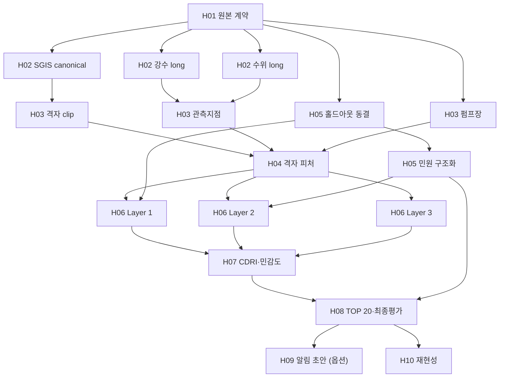

# 하네스 실행 DAG 설계

> 대상: `docs/RESEARCH_HARNESS.md` §4 실행 구조(H01~H10)를 선언형 DAG와 실행기로 구현한 것.
> 선언: `config/pipeline.yaml` · 실행기: `src/pipeline/` · 노드 코드: `src/stages/` · 데이터 로직: `src/data/` · 테스트: `tests/test_pipeline.py`

## 1. 왜 DAG인가

하네스 문서는 "어떤 단계가 어떤 입력을 받아 어떤 산출물을 내고 어떤 기준을 통과해야
하는가"를 이미 고정했다. 빠진 것은 그 규칙을 **기계가 강제하는 장치**였다.
DAG 실행기는 다음 네 가지를 사람 대신 맡는다.

| 하네스 규칙 | 실행기가 강제하는 방식 |
|---|---|
| 상류 게이트를 통과하기 전에 하류를 실행하지 않는다 | `depends_on` 위상정렬 + fail-fast |
| 산출물이 없으면 완료가 아니다 | `outputs` 전부 존재해야 `pass`; 아니면 `missing_output` |
| 같은 입력이면 같은 결과여야 한다 | 입력·코드·파라미터·상류 출력 checksum으로 fingerprint → 변하지 않으면 건너뜀 |
| 완료 증거(commit·dirty·checksum·명령·환경·지표)를 남긴다 | `artifacts/runs/<run_id>/manifest.json` 자동 기록 |

### 1-1. 이것은 어디까지가 "그래프 엔지니어링"인가

[GeekNews: Graph 엔지니어링 vs Loop 엔지니어링](https://news.hada.io/topic?id=32544)의 구분으로 보면
§4~§5(의존성·캐시·manifest)는 글이 "Workflow Engine / DAG Scheduler — 오래전부터 있던 것"이라 부른
**결정적 골격**이다. 글이 그래프 엔지니어링의 실제 질문이라고 한 것은 다음이고, 각각 §3-2의 필드로 답한다.

| 글의 질문 | 이 프로젝트의 답 | 필드 |
|---|---|---|
| 누가 결과를 검증하나 | 코드(결정적 검사) / 외부 증거(침수흔적·사례지·홀드아웃) / 사람 검수 | `verify[].kind` |
| 누가 거부권을 갖나 | R1·R2·R3가 노드 8곳에서 — 승인 없으면 하류 닫힘 | `approval` |
| 실패하면 어디로 되돌아가나 | 상류 노드(`goto`) 또는 분기(tier 모드 등) | `on_fail.goto` / `action` |
| 반복·비용 상한은 어디서 | 노드별 `max_iterations`, 초과 시 `exhausted` | `on_fail.max_iterations` |
| 무엇을 병렬로 | 현재 없음 — 병목은 사람 검수 | — |
| 독립 Reviewer(다른 모델·새 컨텍스트) | 현재 없음 — Agent 노드가 H05 민원 추출 하나뿐. 추가 시 `verify.kind: external`로 연결 | — |

이 프로젝트의 "Fixer"는 LLM이 아니라 사람이다. 그래서 실행기는 실패 시 자동으로 되감지 않고,
**어디로 가서 무엇을 고칠지 출력하고 시도 횟수를 센다.** 한 장 그림: `python -m src.pipeline graph --with-state`.

## 2. 큰 단계 4개와 되돌아가는 길

그래프는 큰 단계(phase) 4개로 묶이고, 각 단계 안에 세분화된 노드가 있다. 막히면 **원인이 있는 단계의 노드로**
되돌아간다 — 원인이 데이터면 P1의 수집 확인(`h00_collect_inventory`)까지.

| Phase | 노드 | 닫히는 조건 (`phases[].exit`) | 이 단계의 "확인 EDA" |
|---|---|---|---|
| **P1 데이터 확보·검증** | 접근신청 현황 1 + 데이터 묶음 5개(강수 / 하천수위 / 펌프장·하천 목록 / SGIS 통계·경계 / 토지피복·DEM) × (수집 확인 → 원본 검증) + 원본 검증 종합 = 12 노드 | 모든 계약 데이터가 취득 기록·checksum과 함께 존재, 묶음별·전체 H01 strict 통과, 묶음별 R1 사용 가능 판정 | 묶음별 H01 보고서 + 사람의 "써도 되는가" 판정 |
| **P2 전처리·EDA** | H02 3개 → `h02_eda_data_check` → H03 3개 → H04, H05 2개 | canonical·격자·피처 완성, 데이터 확인 EDA 이상 없음 | `h02_eda_data_check` — 통계·좌표·기간으로 "써도 되는 데이터인가" 판정 |
| **P3 방법론 검증** | H06 Layer 1~3 → H07 | 외부 증거·강건성 기준 통과, 산식 확정 | Layer별 external verify |
| **P4 결과 확인·보고** | H08 → `h08_result_review` → H09·H10 | 결과 EDA·홀드아웃 평가 후 제출 승인, 재현성 통과 | `h08_result_review` — 독립 침수자료와 대조 |

되돌아가는 길(`on_fail.goto`)의 규칙:
- goto는 **자기 자신 또는 상류**만 허용하고 단계를 거슬러 올라갈 수 있다 (P2 강수 정제 실패 → P1 **강수량** 수집 확인). 묶음별로 쪼개져 있으므로 틀린 데이터만 다시 모으고, 나머지 묶음은 캐시로 건너뛴다.
- 어디로 갈지는 사람이 **원인을 적고** 정한다. `h02_eda_data_check`의 action: "원인이 데이터면 h00, 정제 규칙이면 해당 h02_* 수정. 어느 쪽인지 `docs/eda_data_check.md`에 기록".
- `python -m src.pipeline run --phase P2` 로 단계 단위 실행, `plan --phase P2` 로 어느 노드가 막혔는지 본다.

## 2-1. 그래프



`python -m src.pipeline graph`가 `config/pipeline.yaml`에서 같은 그림을 생성하므로, 그림이 아니라 YAML이 진실이다.

(아래 그림은 phase subgraph 추가 전 버전이다. 최신 그림은 `python -m src.pipeline graph --with-state`.)

노드 분할 원칙: **하네스 게이트 하나 = 노드 하나**를 기본으로 하되, 하네스가 "sub-gate로
병렬 개방"한다고 명시한 곳(H02 강수/수위/SGIS, H03 격자/지점/펌프, H05 분할/추출, H06 Layer 1~3)만
쪼갠다. 더 잘게 쪼개고 싶으면 먼저 하네스 문서의 게이트 표를 고친다.

## 3. 노드 계약

`config/pipeline.yaml`의 노드 하나:

```yaml
h02_rainfall_long:
  gate: H02                                   # RESEARCH_HARNESS §5 게이트 ID
  phase: P2                                   # 큰 단계 P1~P4
  title: 강수 정제(long 변환)                  # 그림·표·plan 출력에 쓰는 한글 이름 (id 는 명령어용)
  runner: src.stages.h02_normalize:rainfall_long   # 모듈:함수
  depends_on: [h01_raw_contract]
  inputs: ["data/raw/경상남도 창원시_시간별 강수량_*.csv"]   # 내용 checksum 대상
  outputs: [data/processed/canonical/rainfall_hourly.parquet, data/processed/quarantine/rainfall_hourly.csv]
  params: [analysis.climatology_start, analysis.climatology_end, analysis.min_station_day_coverage]
  optional: false                             # true면 실패가 하류를 막지 않음 (H09만)
```

runner 함수 계약 (`src/stages/__init__.py`에도 명시):

```python
def rainfall_long(ctx: StageContext) -> dict[str, Any]:
    # ctx.inputs   : 존재하는 입력 파일 (glob 해제, 절대경로)
    # ctx.params   : params 키를 config.yaml에서 뽑은 값
    # ctx.outputs  : 선언된 출력 절대경로 — 여기에만 쓴다
    # ctx.run_dir  : artifacts/runs/<run_id>/<node_id>/ — 로그·중간 표 저장처
    # 통과 기준 미달 → raise StageFailed("사유", findings=[...])
    # 반환 dict     → manifest의 metrics
```

**숨은 입력 금지.** runner가 `inputs`·`params`·상류 `outputs`에 없는 것을 읽으면 캐시가 거짓 적중한다.
새 입력이 필요하면 YAML에 먼저 선언한다. 임계치는 `config/config.yaml`에 두고 `params`로 선언한다
(코드에 하드코딩하면 바뀌어도 재실행되지 않는다 — 단, runner 모듈 파일 자체의 변경은 감지된다).

### 3-2. 오케스트레이션 필드 — 검증·거부권·루프

```yaml
  verify:                                   # 판정 주체 (여러 개 가능)
    - {kind: code,     rule: "키 유일, 행수 보존식"}        # runner 내부 StageFailed
    - {kind: external, rule: "침수흔적 AUC ≥ 0.70"}         # 독립 외부 증거
    - {kind: human,    rule: "좌표 9개 육안 검수"}           # 사람 눈 → approval과 짝
  approval: {who: R1, what: "펌프장 좌표 확정"}             # 사람 거부권
  on_fail:  {goto: h01_raw_contract, max_iterations: 3, action: "waiver 수정 후 재실행"}
  # goto 없음 = 분기 (예: "tier 모드로 강등"). goto는 자기 자신 또는 상류만 허용 (순방향 점프 금지)
```

실행기 동작:

| 상황 | 상태 | 하류 | 다음 행동 |
|---|---|---|---|
| verify 통과, approval 없음 | `pass` | 열림 | — |
| verify 통과, approval 있음, 승인 파일 없음 | `awaiting_approval` | **닫힘** | `python -m src.pipeline approve <노드> --by R1 --note "..."` |
| 승인 후 outputs가 바뀜 | `awaiting_approval` (stale) | 닫힘 | 다시 보고 다시 승인 |
| verify 실패 | `fail` + `next: {goto, action, attempts_left}` | 닫힘 | action대로 고치고 재실행 |
| 같은 입력으로 `max_iterations`회 실패 | `exhausted` — 실행 자체를 거부 | 닫힘 | 입력·코드를 바꾸거나(시도 횟수 0으로) `--force` |
| optional 노드 실패 | `skipped` | 열림 | — |

승인 기록은 `artifacts/approvals/<노드>.yaml`에 남고 **Git으로 추적**한다 (누가 언제 무엇을 보고 거부권을
행사했는지가 연구 증거다). outputs checksum digest에 묶이므로 결과가 1바이트라도 바뀌면 자동 무효다.
시도 횟수는 fingerprint 단위로 세므로 입력이나 코드를 고치면 0부터 다시 센다.

## 4. fingerprint와 캐시

```
fingerprint(node) = sha256(
    node 선언(spec)
  + runner 모듈 파일 sha256
  + inputs 각 파일 sha256
  + params 값
  + 상류 노드별 outputs sha256      ← 상류 fingerprint가 아니라 "결과물" 기준
)
캐시 적중 = 최신 성공 fingerprint 동일 AND 기록된 outputs가 전부 존재하고 sha256 동일
```

상류 결과물 기준이므로 상류가 재실행돼도 byte 동일한 파일을 내면 하류는 건너뛰고, 결과가 조금이라도
달라지면 하류 전체가 다시 돈다. 노드별 최신 성공 기록은 `artifacts/state/<node_id>.json`에 있으며
Git 추적 대상이 아니다. 의심스러우면 `--force`로 무시하거나 `artifacts/state/`를 지운다.

한계: 콘텐츠 해시이므로 비결정적 runner(seed 없는 난수, 실행시각이 파일에 들어가는 경우)는 매번
하류를 무효화한다. 모든 runner는 `analysis.random_seed`를 쓰고 타임스탬프를 결과 파일이 아닌
manifest에만 남긴다.

## 5. run manifest

`artifacts/runs/<run_id>/manifest.json`, `run_id = UTC시각-GitShortSHA-configSHA8` (하네스 §4 규칙).

| 키 | 내용 |
|---|---|
| `git_commit`, `git_dirty`, `git_diff_sha256` | `validate_raw.git_worktree_provenance()` 재사용 |
| `config_sha256`, `pipeline_sha256`, `requirements_sha256` | 설정·DAG·패키지 lock 결속 |
| `command`, `python`, `platform` | 재실행 명령과 환경 |
| `selected`, `status`, `failed_at` | 실행 대상, 전체 판정, 중단 지점 |
| `nodes.<id>.status` | `pass` / `cached` / `fail` / `skipped`(optional 노드 실패) |
| `nodes.<id>.fingerprint`, `inputs`, `params`, `outputs` | 입·출력 checksum |
| `nodes.<id>.metrics`, `findings`, `error`, `duration_s` | runner 반환 지표와 실패 근거 |

보고서에 수치를 옮길 때는 그 수치를 만든 `run_id`를 같이 적는다 (`artifacts/README.md`).

## 6. 명령

```bash
python -m src.pipeline plan                  # 무엇이 run/cached 인지 미리 보기 (실행 안 함)
python -m src.pipeline run                   # 전체
python -m src.pipeline run --target h04_grid_features   # 이 노드와 상류까지
python -m src.pipeline run --only h02_rainfall_long     # 이 노드만 (상류는 저장된 출력 checksum 사용)
python -m src.pipeline run --phase P2                   # 큰 단계 P2 까지 전부
python -m src.pipeline run --force           # 캐시 무시
python -m src.pipeline status                # 노드별 최신 성공 run_id
python -m src.pipeline approve h01_raw_contract --by R1 --note "waiver 8건 사유 확인"   # 사람 승인
python -m src.pipeline graph --with-state    # 검증·승인·루프백 포함 mermaid, 현재 상태 색상
python -m unittest discover -s tests         # 실행기 회귀 테스트 포함
```

종료 코드: 전부 pass/cached/skipped면 0, `fail`·`exhausted`·`awaiting_approval`로 멈추면 1.

## 7. 현재 상태와 다음 작업

| 노드 | 상태 |
|---|---|
| `h01_raw_contract` | **구현 완료** — 기존 `validate_contract(fail_on="warning")`를 감쌈. pyproj·rasterio 없는 환경에서는 미승인 warning 4건으로 정상 실패함 (하네스 §9대로 가상환경에서 실행) |
| `h01_contract_<묶음>` ×5 | **구현 완료** — 같은 validator 를 `only=` 로 묶음만 검증 |
| 나머지 23개 | `NotImplementedError` stub. 각 함수 docstring에 통과 기준·metrics 키가 적혀 있음 |

노드를 구현할 때의 완료 정의:
1. `src/stages/pending.py` 에서 해당 함수를 빼내 게이트별 모듈(`h04_features.py` 등)로 옮기고 `config/pipeline.yaml` 의 runner 경로를 고친다. 무거운 로직은 `src/data`·`src/models`·`src/visualization` 에 두고 stage 는 조립만 한다.
2. 통과 기준 미달 분기에서 `StageFailed`를 던지는 테스트를 `tests/`에 추가한다.
3. `python -m src.pipeline run --target <노드>`가 `pass`하고, 두 번째 실행이 `cached`임을 확인한다.
4. manifest의 `run_id`를 해당 G-goal 증거에 적는다.

## 8. 의도적으로 넣지 않은 것

- **병렬 실행**: 노드 수 17개, 병목은 I/O가 아닌 사람의 검수다. 직렬 + 캐시로 충분하다.
- **자동 루프백**: `on_fail.goto`로 실행기가 스스로 되감지 않는다. 고치는 주체가 사람이므로 자동 재시도는 같은 실패를 N번 반복할 뿐이다. Agent가 고치는 노드(H05 추출)가 늘어나면 그 노드에 한해 자동 재시도를 붙인다.
- **원격 캐시·스케줄러(Airflow/Prefect/DVC)**: 팀 3인·마감 9/30에 운영 비용이 더 크다. DVC로 갈아탈 일이 생기면 `pipeline.yaml`의 inputs/outputs 선언이 그대로 `dvc.yaml`로 옮겨진다.
- **탐색용 노트북 노드**: 노트북은 탐색용이다(하네스 §4). 단, "데이터를 써도 되는가"·"결과가 말이 되는가"를 판정하는 **확인 EDA**는 통과 기준을 가진 노드다(`h02_eda_data_check`, `h08_result_review`). 탐색과 판정을 구분한다.

## 10. 파일 구조

| 위치 | 역할 |
|---|---|
| `config/pipeline.yaml` | 노드 선언 (검증·승인·복구 규칙 포함). **단일 진실 원천** |
| `src/pipeline/graph.py` | DAG 로드·검증·위상정렬 |
| `src/pipeline/mermaid.py` | 그림 생성 (DAG 로직과 분리) |
| `src/pipeline/runner.py` | 실행·캐시·승인·시도 상한 |
| `src/pipeline/manifest.py` | fingerprint·run manifest·승인 파일 |
| `src/pipeline/__main__.py` | CLI |
| `src/data/*.py` | 실제 데이터 로직 (정제·표준화·공간·품질판정). 파일 입출력 없음, 단위 테스트 가능 |
| `src/visualization/*.py` | 그림. 판정하지 않고 그리기만 |
| `src/stages/h*.py` | 구현된 노드. 파일 읽어 로직에 넘기고 결과를 쓰는 얇은 층 |
| `src/stages/pending.py` | 미구현 노드. docstring 이 통과 기준 계약 |

**규칙**: 판정 로직은 `src/data`, 그림은 `src/visualization`, 조립은 `src/stages`.
stage 함수가 100줄을 넘으면 로직이 잘못된 층에 있는 것이다.
